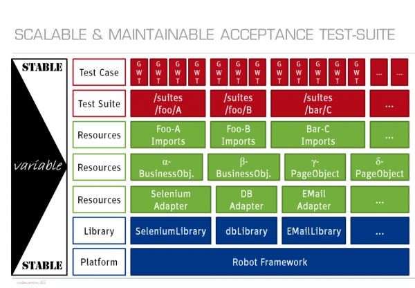

title: Automation Best Practices
author:
    name: ybian
    email: ybian@redhat.com
theme: sudodoki/reveal-cleaver-theme
output: Automation_Best_Practice.html

--

# Automation Best Practices

--

## Introduction

  * This is not a user guide of [Robot Framework][Robot Framework]

  * This a guide trying to set a Coding Style of our Automation Scripts

  * This is just a draft, and I need your help to build it

[Robot Framework]: http://robotframework.org

--

## Robot Framework Layers

  Following picture illustrates the architecture of robot framework automation project

  

--
## Robot Framework Layers

  - [Test cases file](http://robotframework.org/robotframework/latest/RobotFrameworkUserGuide.html#test-case-files): test suite
  - [Resources file](http://robotframework.org/robotframework/latest/RobotFrameworkUserGuide.html#resource-files): variables and high-level user keywords
  - [Library](http://robotframework.org/robotframework/latest/RobotFrameworkUserGuide.html#using-test-libraries): low-level keywords

--

## Structure

```
.
├── cases
│   ├── 01__webui
│   │   └── 01__wiki_test.txt
│   └── 02__cmd
│       └── 01__gherkin.txt
├── doc
│   ├── demo_cases_doc.html
│   └── resource_docs
│       ├── cmd_res.html
│       ├── common_res.html
│       └── wiki_robot_page.html
├── others
├── resources
│   ├── CalculatorLibrary.py
│   ├── search_page.txt
│   └── wiki_robot_page.txt
├── results
└── scripts
    └── __init__.py

```

--

## Files formats

  * For Test and Resources Format we use  [**Plain Text Format**](http://robotframework.org/robotframework/latest/RobotFrameworkUserGuide.html#plain-text-format)

  * Using [**two or more spaces**](http://robotframework.org/robotframework/latest/RobotFrameworkUserGuide.html#plain-text-format)
    - Do not use **pipe character**

--

### Tips

  * Tabs or Spaces?
    - Spaces
    - Or soft-tabs with 2 or 4 space indent, means you need set your editor as "Convert Indentation Spaces"

  * Keep lines fewer than 80 characters, use `...` when it too long

  * Never leave trailing whitespace

  * End of file with a blank newline

--

### Tips

  * Indent with 4 spaces

  * Use at least 4 spaces between columns.

  * Separate tables with two blank lines

  * Separate tests or keywords with a single blank line

  * Documatations: best add document for every suite, case, keyword and library

--

### Naming Conventions

  * Suite Names: use the [`lower_case_with_underscores`](http://robotframework.org/robotframework/latest/RobotFrameworkUserGuide.html)

  * Test Steps: use the [`Given/When/Then`](http://robotframework.org/robotframework/latest/RobotFrameworkUserGuide.html)

  * Keyword Names: use the [`Cap Words`](http://robotframework.org/robotframework/latest/RobotFrameworkUserGuide.html) style

  * Global General Variable Names: use the [`${CapWords}`](http://robotframework.org/robotframework/latest/RobotFrameworkUserGuide.html)

  * Page Elements Variable Names: use the [`${CapWords Locator}`](http://robotframework.org/robotframework/latest/RobotFrameworkUserGuide.html)

--

  Writing Automation is Software Development

--

  References

  * [Robot Framework Guide](http://robotframework.org/robotframework/latest/RobotFrameworkUserGuide.html)

  * [PEP8](https://www.python.org/dev/peps/pep-0008/)

  * [Writing Maintainable Automation Scripts](http://dhemery.com/pdf/writing_maintainable_automated_acceptance_tests.pdf)

  * [Anatomy of a good acceptance test](http://gojko.net/2010/06/16/anatomy-of-a-good-acceptance-test/)
