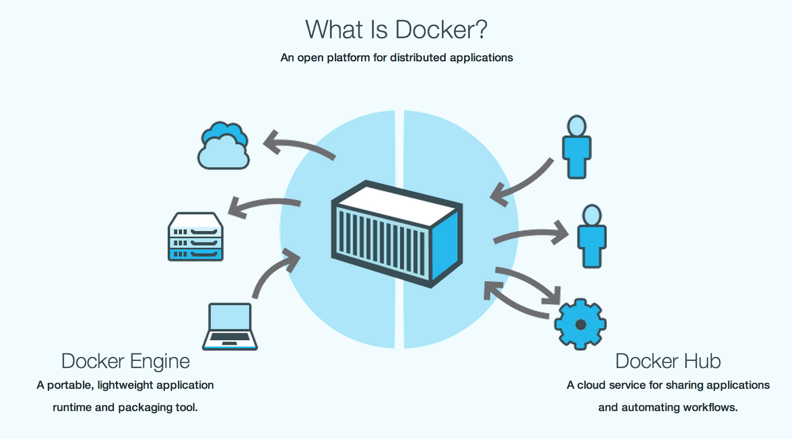
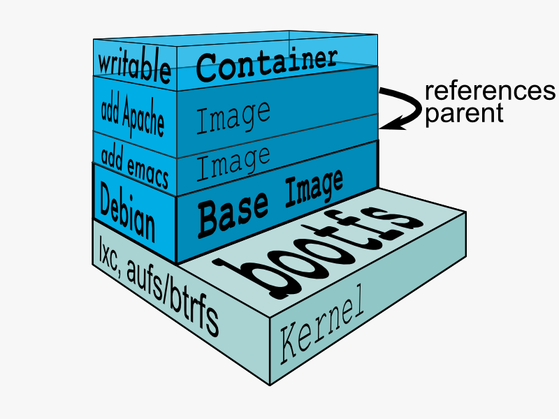

title: RobotX in Docker
author:
    name: ybian
    email: ybian@redhat.com
theme: sudodoki/reveal-cleaver-theme
output: RobotX_Docker.html

--

# RobotX in Docker

--

### Agenda

  * Why Docker?

  * What is Docker?

  * Using Docker for automation

--

### Automation problems

  * Compute instance on [OpenStack][OpenStack] became very slow after a period of time

  * Automation test run will breakdown if there is any network issue when running distributed

  * [TCMS][TCMS] is slow, read/write operation in [TCMS][TCMS] waste lots of time

[OpenStack]:https://www.openstack.org/
[TCMS]:https://tcms.engineering.redhat.com/

--

### What is Docker

  * [Docker][Docker] is an open-source platform of containers, which is an additional layer of operating-system-level virtualization on Linux.

    - [Linux kernel namaspaces](https://www.kernel.org/doc/Documentation/namespaces/)

    - [Linux kernel cgroups](https://www.kernel.org/doc/Documentation/cgroups/cgroups.txt)

[Docker]:https://www.docker.com/

--

### What is Docker

  

--

### Docker VS VM

  * [VM][VM] includes not only the application and the necessary binaries and libraries, but also an entire guest operating system, which may weigh 10s of GB

  * [Docker][Docker] container just the application and its dependencies. It runs an isolated process in userspace on the host operating system, sharing the kernel with other containers.

[VM]:https://en.wikipedia.org/wiki/Virtual_machine
[Docker]:https://www.docker.com/

--

### Docker VS VM

  

--

### Docker Containers

  * A [Docker container][Docker container] holds everything that is needed for an application to run.

  * Each [container][Docker container] is created from a Docker image.

  * Each [container][Docker container] is an isolated application platform.

[Docker container]: http://docs.docker.com/userguide/usingdocker/

--

### Docker Containers

  

--

### How to run/start/stop/delete Docker container

  * [`$ docker run -it --name test fedora:21 /bin/bash`](http://docs.docker.com/userguide/)

  * [`$ docker start test`](http://docs.docker.com/userguide/)
    [`$ docker attach test`](http://docs.docker.com/userguide/)

  * [`$ docker stop test`](http://docs.docker.com/userguide/)

  * [`$ docker rm test`](http://docs.docker.com/userguide/)

--

### Docker Images

  * [Docker images][Docker images] is a read-only template.

  * Images are used to create [container][Docker container].

  * How to get a Docker image?

    - [Docker Hub][Docker Hub]

    - Build Docker image by yourself

[Docker container]: http://docs.docker.com/userguide/usingdocker/
[Docker images]:http://docs.docker.com/userguide/dockerimages/
[Docker Hub]:https://hub.docker.com/

--

### Build our automation Docker image

  * [Dockerfile][Dockerfile] is a document that contains all the commands you would execute manually in order to build a Docker image.

  * [`$ docker build -t test .`](http://docs.docker.com/userguide/)

[Dockerfile]: http://docs.docker.com/reference/builder

--

### Build our automation Docker image

  * [`FROM`](http://docs.docker.com/reference/builder/#from): sets the base image for subsequent instructions

  * [`RUN`](http://docs.docker.com/reference/builder/#run): execute any commands in a new layer on the top of the current image and commit the results

  * [`ENV`](http://docs.docker.com/reference/builder/#env): sets the environment variable `<key>` to the value `<value>`

  * [`CMD`](http://docs.docker.com/reference/builder/#cmd): provide defaults for an executing container. There only be one CMD in a Dockerfile

--

### Using Xvfb to create a fake display for firefox

  * Docker container do not have a display

  * Most of our automation test cases are web related

  * Using [Xvfb][Xvfb]

    - [`export DISPLAY=:99`](http://docs.docker.com/userguide/)

    - [`Xvfb :99 &`](http://docs.docker.com/userguide/)

    - [`firefox`](http://docs.docker.com/userguide/)

[Xvfb]:http://www.x.org/archive/X11R7.6/doc/man/man1/Xvfb.1.xhtml

--

### Automation Code Storage

  * We can use one container for storing automation code, and other containers read from this container

  * Start a contianer for storing
    - [`$ docker run --itd -v /data/ --name git-branch_name git /bin/bash`](http://docs.docker.com/userguide/)

  * Start a container for running
    - [`$ docker run -it --volumes-from git-branch_name --name test_robotx robotx /bin/bash`](http://docs.docker.com/userguide/)

--

# Q & A
